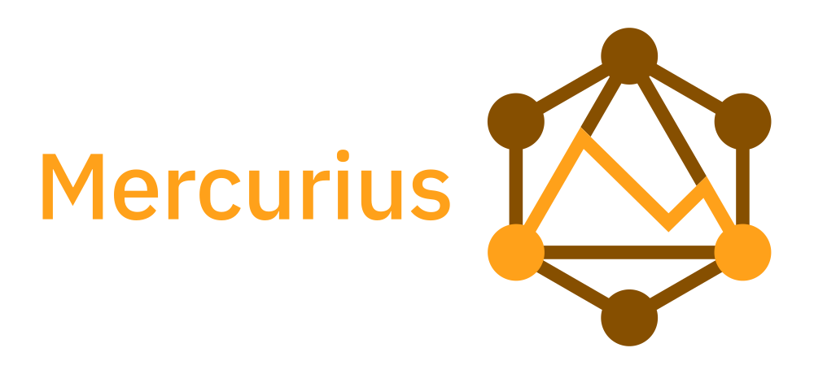
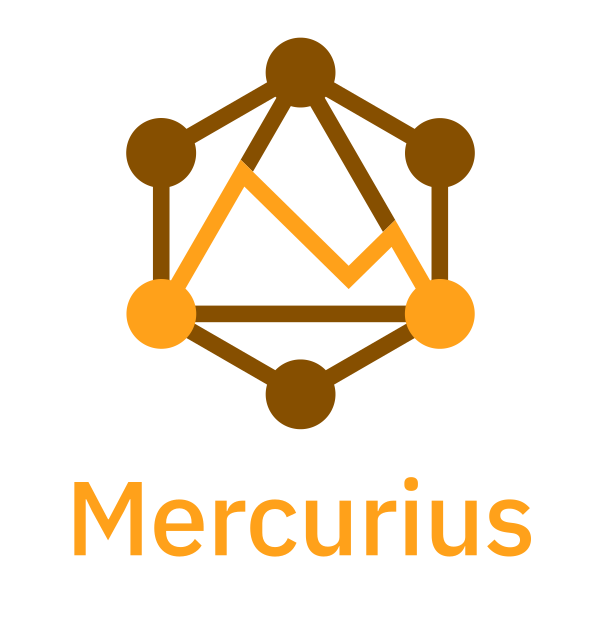

# Mercurius Graphics

[][cc-by]

> Logo for [Mercurius](https://github.com/mercurius-js/mercurius).

<table>
  <tr>
    <th>icon</th>
    <th>horizontal</th>
    <th>stacked</th>
  </tr>
  <tr>
    <td></td>
    <td></td>
    <td></td>
  </tr>
</table>

### Color Palette

<table>
	<tr>
		<th></th>
		<th width="150">RGB</th>
		<th width="150">Hex</th>
	</tr>
  <tr>
		<td>&#9679;</td>
		<td>(255, 161, 26)</td>
		<td>#FFA11A</td>
	</tr>
  <tr>
    <td>&#9679;</td>
		<td>(134, 79, 0)</td>
		<td>#864F00</td>
  </tr>
</table>

### Typeface

[IBM Plex](https://www.ibm.com/plex/) Sans Medium was used to set Mercurius name. The typeface is licensed under the [SIL Open Font License 1.1](https://scripts.sil.org/OFL).

Font files are available at https://github.com/IBM/plex.

### Acknowledgements

Mercurius logo was designed by [Tom Mrazauskas](https://github.com/mrazauskas).

This artwork is a derivative of [GraphQL logo](https://github.com/graphql/artwork), a trademark of the Linux Foundation, used under [Creative Commons Attribution 4.0 International License][cc-by].

### License

Mercurius logo is licensed under a
[Creative Commons Attribution 4.0 International License][cc-by].

[cc-by]: http://creativecommons.org/licenses/by/4.0/
